# Java Build Farm

<p align="center">
  
</p>

## Obsah
1. [Overview](#overview)
2. [Features](#features)
3. [Prerequisites](#prerequisites)
4. [Directory Structure](#directory-structure)
5. [Usage](#usage)
6. [Setting Up Build Nodes](#setting-up-build-nodes)
7. [Preparing the Build Farm](#preparing-the-build-farm)
8. [Configuring PowerShell on Windows 10/11](#configuring-powershell-on-windows-1011)
9. [Configuring SSH Key-Based Authentication](#configuring-ssh-key-based-authentication)
10. [Configuring Passwordless Sudo for Linux Stations](#configuring-passwordless-sudo-for-linux-stations)
11. [Configuring RPM Signing (GPG)](#configuring-rpm-signing-gpg)
12. [License](#license)

## Overview
Java Build Farm is a script-based automation system for building and packaging Java applications across multiple operating systems and distributions. It enables automatic dependency installation, building, and distribution of Java applications using Proxmox virtual machines and remote hosts.

## Features
- Automated dependency installation for Linux and Windows hosts
- Support for multiple distributions (Debian, Ubuntu, Fedora, Rocky Linux, openSUSE, Windows 10/11)
- SSH-based remote execution and deployment
- Java Runtime creation using `jlink`
- Application packaging using `jpackage`
- Multi-platform package generation (`.deb`, `.rpm`, `.pkg`, `.exe`)
- Automated RPM package signing using GPG
- `.exe` installer builds using [Inno Setup Compiler](https://jrsoftware.org/isinfo.php)
- Remote VM/host provisioning via Proxmox
- Secure, passwordless SSH authentication

## Prerequisites

### On Java Build Farm (local machine):
- **Linux with GNU Bash**
- **Internet access**
- **SSH client:** `ssh`, `scp`
- **Other utilities:** `ping`, `sudo`, `bash`, `tar`, `find`, `awk`, `sed`, `cut`, `head`, `tr`, `rm`, `mkdir`, `chmod`, `sha256sum`
- **RPM Signing:** `rpmsign` (usually from the `rpm-sign` or `rpm` package) and `gpg` (for key management)
- **Proxmox:** (If using Proxmox for VMs)
- **PowerShell 7.2 or higher:** (For building on Windows hosts)

### On Build Stations (remote machines):
- **Internet access**
- **SSH Server:** With key-based authentication enabled
- **Linux stations:**
    - Modified `sudoers` file (allow passwordless execution)
- **Windows stations:**
    - PowerShell 7.2.2 or higher

## Directory Structure

```
java-build-farm/
├── README.md                        # Project documentation
├── apps/                            # Source code and metadata for applications
│   └── AppName/
│       └── 1.0/                     # Application version folder
│           ├── AppName.iss          # Windows installer (Inno Setup script)
│           ├── AppName.properties   # File association definitions
│           ├── AppName.ps1          # Build script for Windows
│           ├── AppName.sh           # Build script for Linux
│           ├── addons/              # Additional resources such as licenses
│           │   └── License.txt
│           ├── build/               # Compiled application JARs
│           │   ├── AppName-1.0.jar
│           │   └── libs/            # Required libraries
│           │       ├── *.jar
│           └── icons/               # Application icons
│               ├── *.ico
│               └── *.png
├── config/                          # Build environment definitions
│   ├── global.cfg
│   ├── hosts.cfg
│   └── vms.cfg
├── depends.ps1                      # Dependency setup for Windows
├── depends.sh                       # Dependency setup for Linux/macOS
├── farm.sh                          # Central build and packaging script
└── release/                         # Output directory for generated packages
    └── appname/
        └── 1.0/
            └── *-*/                 # Platform-specific folders (OS + version + arch)
                ├── *.deb/.rpm       # Native packages (Linux)
                ├── *.exe            # Windows installers
                ├── *.zip            # Portable builds
                └── *.tar.gz         # Archive versions
```

## Usage

### Running `farm.sh`

Execute the main script to access the menu:

```sh
./farm.sh
```

Example output:
```bash
This script is for building applications on remote VMs and hosts

Proxmox VM Manager (192.168.88.3)

Action ?
1) Check
2) Dependencies
3) Clean
4) Build
5) Download (URL paths)
6) Sign & Hash
7) VMs Status
8) VMs Start
9) VMs Stop
q) Quit
#?
```
Select an action by entering the corresponding number or <kbd>q</kbd> for exit.

### **Menu Options - Detailed Explanation**  

The build farm automation script (`farm.sh`) provides an interactive **menu-driven interface** for managing the build process across multiple remote machines (**Linux** and **Windows**) using **SSH**. Each option in the menu performs a specific function, interacting with **virtual machines (VMs)**, **physical hosts**, and **configuration files**.  

---

#### System Setup & Cleanup (Check, Dependencies, Clean)


##### **1) Check**  
- Verifies **SSH connectivity** to all configured build nodes.  
- Ensures machines are **reachable and correctly set up**.  
- Checks **internet access, shell availability**, and essential system commands.  
- On Linux: Verifies **Bash, sudo, and network access**.  
- On Windows: Checks **PowerShell version, execution policy, and connectivity**.  

##### **2) Dependencies**  
- Detects **OS type** (Linux/Windows) for each build node.  
- Copies and executes the appropriate **dependency installation script**:  
  - `depends.ps1` for Windows  
  - `depends.sh` for Linux  
- Installs essential packages like **OpenJDK, 7zip, fakeroot, binutils**.  
- On Windows, adjusts the **PowerShell Execution Policy**.  
- Ensures all necessary tools are installed for the build process.  

##### **3) Clean**  
- Allows the user to **select an application** from the `apps/` directory.
- Removes **temporary build artifacts** from all nodes.  
- Deletes the **build directory** on each machine.  
- Deletes the corresponding **release directory** for the selected application/version.  
- Ensures old files do not interfere with new builds.  
- Uses appropriate **deletion commands** for Linux and Windows environments.  

---

#### Build & Deployment (Build, Download, Sign & Hash)

```mermaid
graph TD;
    A[User] -->|Runs farm.sh| B(Main menu);

    B -->|Compile & Package App| C4[4 = Build];
    B -->|Retrieve Built Packages| C5[5 = Download];
    B -->|Sign & Hash| C6[6 = Sign & Hash];

    %% Build
    C4 -->|Select App & Version| E1[Copy Source Code];
    E1 --> E2[Windows: AppName.ps1];
    E1 --> E3[Linux: AppName.sh];
    E2 --> F1[Compile & Package];
    E3 --> F1;
    F1 --> F2[Archive artifacts on the build computer];

    %% Download
    C5 -->|Select App & Version| D2[Retrieve Packages via SSH/SCP];
    D2 --> D3[Apply URL path optimization];
    D3 --> D4[Saved on local machine];

    %% Sign & Hash
    C6 -->|Select App & Version| G1[Sign .rpm packages with GPG];
    G1 --> G2[Generate SHA256 checksum files];

    style C4 stroke:#aaa,stroke-width:3px,font-weight:bold;
    style C5 stroke:#aaa,stroke-width:3px,font-weight:bold;
    style C6 stroke:#aaa,stroke-width:3px,font-weight:bold;
```



##### **4) Build**

- Allows the user to **select an application** from the `apps/` directory.  
- Copies the **application source code** to the target machine.  
- Runs the **platform-specific build script**:  
  - `AppName.ps1` for Windows  
  - `AppName.sh` for Linux  
- Compiles the application and packages.  
- Archives the final build artifacts in the **release directory**.  

##### **5) Download**

- Allows the user to **select an application** from the `apps/` directory.  
- Retrieves **built application artifacts** from remote machines.
- Uses **SSH & SCP** to copy the packaged files.
- Optionally applies URL path optimization (lowercase, dashes) if `release_url_paths=yes`.
- Stores them in the local **release directory**.

##### **6) Sign & Hash**

- Allows the user to **select an application** from the `apps/` directory.  
- Automatically signs all found `.rpm` packages using the GPG key specified in `global.cfg`.
- Generates **SHA256 checksum files** (`filename.sha256`) for all downloaded files.

---

#### Virtual Machine Management (VMs Status, Start, Stop)


##### **7) VMs Status**  
- Queries the **Proxmox hypervisor** for VM status.  
- Lists each VM as **Running, Stopped, or Unavailable**.  
- Helps administrators monitor the **build infrastructure**.  

##### **8) VMs Start**  
- Starts each VM using **Proxmox commands**.  
- Ensures the machine is **ready before proceeding** with builds.  

##### **9) VMs Stop**  
- Gracefully **shuts down virtual machines** after builds are completed.  
- Helps **free up system resources** while ensuring all tasks have been executed.

---

### Setting Up Build Nodes
The build farm consists of virtual machines (VMs) and/or physical hosts that are configured to perform automated builds. The configuration is managed through the following files:

#### Global Configuration (`config/global.cfg`)

   Proxmox server configuration is optional. If these variables are not set (proxmox_server, proxmox_user), VM-related menu options will be hidden. Target machines are contacted directly via SSH, with configurations defined in:
   - config/vms.cfg (for VMs)
   - config/hosts.cfg (for other hosts)

   Example:
   ```sh
   # Global Configuration File
   # This file contains general settings for Java Build Farm,
   # defining key paths and remote server details.

   # Directory where application source files and configurations are stored
   apps_dir="./apps"

   # Directory where built application packages will be stored locally
   release_dir="./release"

   # Controls whether directory names are optimized for URL compatibility after downloading from remote machines.
   # Options:
   #   - "yes": Optimize all directories for URL compatibility (e.g., "My App/1.0/Setup.exe" → "my-app/1.0/Setup.exe").
   #   - "no" : Keep original directory names as they are, leaving files unchanged.
   release_url_paths="yes"

   # Default directory for storing build artifacts on remote machines
   build_dir=".build"

   # IP address of the Proxmox server used for managing virtual machines
   proxmox_server=192.168.88.3

   # SSH user for accessing the Proxmox server
   proxmox_user=root

   # GPG key configuration for signing RPM packages
   # Use the key ID or user identity associated with the signing key.
   # Example: 9E736AF1D162F3F6FF21E3659A1A41C5DDF5A11A or "Marek Liška <adlatus@marelis.cz>"
   gpg_key_id="9E736AF1D162F3F6FF21E3659A1A41C5DDF5A11A"
   ```

#### Virtual Machines Configuration (`config/vms.cfg`)

   Example:
   ```sh
   # Virtual Machines Configuration File
   # Each line represents a VM used in the build farm.
   #
   # Format:
   # <vm_id> <ssh_user>@<ip_address> <os_type> <os_name>
   #
   # - <vm_id>       : Unique identifier of the VM in Proxmox
   # - <ssh_user>    : Username used to connect via SSH
   # - <ip_address>  : IP address of the virtual machine
   # - <os_type>     : Type of operating system ("lin" for Linux, "win" for Windows)
   # - <os_name>     : Full name of the operating system including version and architecture

   100 marel@192.168.88.100 win Windows 10 Pro 22H2 x64
   101 marek@192.168.88.101 lin Ubuntu Desktop 24.04.2 LTS x64
   102 marek@192.168.88.102 lin Kubuntu Desktop 24.04.2 LTS x64
   103 marek@192.168.88.103 lin Xubuntu Desktop 24.04.2 LTS x64
   104 marek@192.168.88.104 lin Lubuntu Desktop 24.04.2 LTS x64
   105 marek@192.168.88.105 lin openSUSE Tumbleweed x64
   106 marek@192.168.88.106 lin Fedora Workstation 41 x64
   107 marek@192.168.88.107 lin Debian 12.9 x64
   108 marek@192.168.88.108 lin Linux Mint Cinnamon 22.1 x64
   109 marek@192.168.88.109 lin Rocky Linux 9.5 x64
   ```

#### Hosts Configuration (`config/hosts.cfg`)

   Example:
   ```sh
   # Host Machines Configuration File
   # Defines physical machines with SSH access for building applications.
   #
   # Format:
   # <ssh_user>@<ip_address> <os_type> <os_name>
   #
   # - <ssh_user>    : Username used to connect via SSH
   # - <ip_address>  : IP address of the host machine
   # - <os_type>     : Type of operating system ("lin" for Linux, "win" for Windows)
   # - <os_name>     : Full name of the operating system including version and architecture

   marel@192.168.88.10 win Windows 11 Pro 24H2 x64
   ```

## Preparing the Build Farm

### Installing Proxmox VE

If you plan to use virtual machines for the build process, you need to install Proxmox VE:

- **Proxmox VE**: [https://www.proxmox.com/en/downloads/proxmox-virtual-environment](https://www.proxmox.com/en/downloads/proxmox-virtual-environment)

### Setting Up Virtual Machines on Proxmox

This section provides step-by-step instructions for setting up virtual machines on **Proxmox** for the Java Build Farm. The guide includes installing various Linux distributions, Windows 10, configuring system settings, enabling SSH access, and setting up passwordless `sudo`.

### Supported Operating Systems

#### Linux Distributions:
- Ubuntu
- Kubuntu
- Xubuntu
- Lubuntu
- openSUSE Tumbleweed
- Fedora Workstation
- Debian
- Linux Mint Cinnamon
- Rocky Linux

#### Windows:
- Windows 10
- Windows 11

### General Steps for All VMs
1. **Download the ISO** for the desired distribution from the official source.
2. **Create a new VM** in Proxmox and attach the ISO.
3. **Adjust VM settings**, such as CPU, memory, disk, and network.
4. **Install the OS** using the "Safe Graphics" or equivalent option.
5. **Set a static DHCP lease** for the VM in your router (if applicable).
6. **Perform post-installation setup**, including updates, SSH setup, and Proxmox agent installation.

---

### Windows 10 Pro 22H2 x64
- **Download**: [Windows 10 ISO](https://www.microsoft.com/cs-cz/software-download/windows10)
- **ISO**: `Win10_22H2_Czech_x64.iso`
- **VM Config**:
  ```sh
   root@pve:~# qm config 100
   agent: 1
   audio0: device=ich9-intel-hda,driver=spice
   boot: order=ide2;scsi0;net0;ide0
   cores: 4
   cpu: x86-64-v2-AES
   ide0: local-ssd:iso/virtio-win-0.1.266.iso,media=cdrom,size=707456K
   ide2: local-ssd:iso/Win10_22H2_Czech_x64.iso,media=cdrom,size=4667200K
   machine: pc-i440fx-9.0
   memory: 12288
   meta: creation-qemu=9.0.2,ctime=1733324057
   name: vm-win10
   net0: virtio=BC:24:11:AB:AA:D8,bridge=vmbr0,firewall=1
   numa: 0
   onboot: 1
   ostype: win10
   scsi0: local-lvm:vm-100-disk-0,cache=writeback,discard=on,size=128G,ssd=1
   scsihw: virtio-scsi-pci
   smbios1: uuid=dafa3c37-9a9b-46cc-9e84-0f81c736d957
   sockets: 1
   tpmstate0: local-lvm:vm-100-disk-1,size=4M,version=v2.0
   usb0: spice,usb3=1
   usb1: spice,usb3=1
   vga: qxl
   vmgenid: 26c46573-9f80-4644-a7b4-92bac9c0ccc4
   ```

#### Step 1: Install Windows
1. Boot from the Windows 10 ISO and proceed with the installation.
2. During installation, attach the **VirtIO drivers ISO**:
   [VirtIO Drivers](https://fedorapeople.org/groups/virt/virtio-win/direct-downloads/archive-virtio/virtio-win-0.1.266-1/virtio-win-0.1.266.iso)
3. Load the **VirtIO storage and network drivers**.
4. Complete the installation and reboot.

#### Step 2: Install QEMU Guest Agent
1. Mount the **VirtIO ISO** inside Windows.
2. Install the **QEMU Guest Agent**:
   ```sh
   guest-agent\qemu-ga-x86_64.msi
   ```
3. Open `services.msc` and ensure that **QEMU Guest Agent** is running.

#### Step 3: Install VirtIO Drivers
1. Install the following drivers from the VirtIO ISO:
   ```sh
   virtio-win-gt-x64.msi
   virtio-win-guest-tools.exe
   ```
2. Reboot the system.

#### Step 4: Install Spice Guest Tools
1. Download and install **Spice Guest Tools**:
   [Spice Guest Tools](https://www.spice-space.org/download/windows/spice-guest-tools/spice-guest-tools-latest.exe)
2. Reboot the system.

#### Step 5: Enable Automatic Login
1. Open **Settings → Accounts → Sign-in options**.
2. Disable **Require Windows Hello sign-in for Microsoft accounts**.
3. Run `control userpasswords2` and uncheck **Users must enter a username and password to use this computer**.
4. Enter the login credentials and apply.
5. After rebooting, Windows should log in automatically.

---

### Ubuntu Desktop 24.04.2 LTS x64
- **Download**: [Ubuntu Desktop](https://ubuntu.com/download/desktop)
- **ISO**: `ubuntu-24.04.2-desktop-amd64.iso`
- **VM Config**:
  ```sh
   root@pve:~# qm config 101
   agent: 1
   audio0: device=ich9-intel-hda,driver=spice
   balloon: 2048
   boot: order=scsi0;ide2;net0
   cores: 2
   cpu: x86-64-v2-AES
   ide2: local-ssd:iso/ubuntu-24.04.2-desktop-amd64.iso,media=cdrom,size=6194550K
   memory: 4096
   meta: creation-qemu=8.1.2,ctime=1704991368
   name: vm-ubuntu
   net0: virtio=BC:24:11:2D:E4:B7,bridge=vmbr0,firewall=1
   numa: 0
   ostype: l26
   scsi0: local-lvm:vm-101-disk-0,cache=writeback,discard=on,size=32G,ssd=1
   scsihw: virtio-scsi-pci
   smbios1: uuid=90573f32-0483-417d-b308-db63cb7a63df
   sockets: 1
   usb0: spice
   usb1: spice
   vga: qxl
   vmgenid: a84dca54-b555-42d1-9fc9-e1b9c932453e
  ```
- **Post-Installation Steps**:
  ```sh
  sudo hostnamectl set-hostname vm-ubuntu
  sudo systemctl daemon-reload
  sudo apt update && sudo apt upgrade
  sudo apt install qemu-guest-agent ssh
  sudo reboot
  ```

---

### Kubuntu Desktop 24.04.2 LTS x64
- **Download**: [Kubuntu](https://kubuntu.org/getkubuntu)
- **ISO**: `kubuntu-24.04.2-desktop-amd64.iso`
- **VM Config**:
  ```sh
  root@pve:~# qm config 102
   agent: 1
   audio0: device=ich9-intel-hda,driver=spice
   balloon: 2048
   boot: order=scsi0;ide2;net0
   cores: 2
   cpu: x86-64-v2-AES
   ide2: local-ssd:iso/kubuntu-24.04.2-desktop-amd64.iso,media=cdrom,size=4421640K
   memory: 4096
   meta: creation-qemu=8.0.2,ctime=1698960955
   name: vm-kubuntu
   net0: virtio=BC:24:11:78:E0:02,bridge=vmbr0,firewall=1
   numa: 0
   ostype: l26
   scsi0: local-lvm:vm-102-disk-0,cache=writeback,discard=on,size=32G,ssd=1
   scsihw: virtio-scsi-pci
   smbios1: uuid=9d18c463-5436-4275-88dd-965ae26c0b77
   sockets: 1
   usb0: spice
   usb1: spice
   vga: qxl
   vmgenid: fbffe671-3846-46ea-9000-1939761cfa4f
  ```
- **Post-Installation Steps**:
  ```sh
  sudo hostnamectl set-hostname vm-kubuntu
  sudo apt update && sudo apt upgrade
  sudo apt install qemu-guest-agent ssh
  sudo reboot
  ```

---

### Xubuntu Desktop 24.04.2 LTS x64
- **Download**: [Xubuntu](https://xubuntu.org/download)
- **ISO**: `xubuntu-24.04.2-desktop-amd64.iso`
- **VM Config**:
  ```sh
   root@pve:~# qm config 103
   agent: 1
   audio0: device=ich9-intel-hda,driver=spice
   balloon: 2048
   boot: order=scsi0;ide2;net0
   cores: 2
   cpu: x86-64-v2-AES
   ide2: local-ssd:iso/xubuntu-24.04.2-desktop-amd64.iso,media=cdrom,size=4143300K
   memory: 4096
   meta: creation-qemu=8.1.2,ctime=1704991368
   name: vm-xubuntu
   net0: virtio=BC:24:11:0D:27:E0,bridge=vmbr0,firewall=1
   numa: 0
   ostype: l26
   scsi0: local-lvm:vm-103-disk-0,cache=writeback,discard=on,size=32G,ssd=1
   scsihw: virtio-scsi-pci
   smbios1: uuid=16c505e8-b81c-4270-9121-5cdc4f68e9a2
   sockets: 1
   usb0: spice
   usb1: spice
   vga: qxl
   vmgenid: 0ac63a5f-ee61-4c85-a912-638053fed6a9
  ```
- **Post-Installation Steps**:
  ```sh
  sudo hostnamectl set-hostname vm-xubuntu
  sudo apt update && sudo apt upgrade
  sudo apt install qemu-guest-agent ssh
  sudo reboot
  ```

---

### Lubuntu Desktop 24.04.2 LTS x64
- **Download**: [Lubuntu](https://lubuntu.me/downloads)
- **ISO**: `lubuntu-24.04.2-desktop-amd64.iso`
- **VM Config**:
  ```sh
   root@pve:~# qm config 104
   agent: 1
   audio0: device=ich9-intel-hda,driver=spice
   balloon: 2048
   boot: order=scsi0;ide2;net0
   cores: 2
   cpu: x86-64-v2-AES
   ide2: local-ssd:iso/lubuntu-24.04.2-desktop-amd64.iso,media=cdrom,size=3273854K
   memory: 4096
   meta: creation-qemu=8.1.2,ctime=1704991368
   name: vm-lubuntu
   net0: virtio=BC:24:11:E2:51:44,bridge=vmbr0,firewall=1
   numa: 0
   ostype: l26
   scsi0: local-lvm:vm-104-disk-0,cache=writeback,discard=on,size=32G,ssd=1
   scsihw: virtio-scsi-pci
   smbios1: uuid=eb7c6013-06f8-42ed-a8ab-77712b2342be
   sockets: 1
   usb0: spice
   usb1: spice
   vga: qxl
   vmgenid: 07e0754e-6160-49a5-afa8-81e61b0f254f
  ```
- **Post-Installation Steps**:
  ```sh
  sudo hostnamectl set-hostname vm-lubuntu
  sudo apt update && sudo apt upgrade
  sudo apt install qemu-guest-agent ssh
  sudo reboot
  ```

---

### openSUSE Tumbleweed x64
- **Download**: [openSUSE Tumbleweed](https://download.opensuse.org/tumbleweed/iso/openSUSE-Tumbleweed-DVD-x86_64-Current.iso)
- **ISO**: `openSUSE-Tumbleweed-DVD-x86_64-Current.iso`
- **VM Config**:
  ```sh
   root@pve:~# qm config 105
   agent: 1
   audio0: device=ich9-intel-hda,driver=spice
   balloon: 2048
   boot: order=scsi0;ide2;net0
   cores: 2
   cpu: x86-64-v2-AES
   ide2: local-ssd:iso/openSUSE-Tumbleweed-DVD-x86_64-Current.iso,media=cdrom,size=4464M
   memory: 4096
   meta: creation-qemu=8.1.2,ctime=1704991368
   name: vm-opensuse
   net0: virtio=BC:24:11:9B:AA:93,bridge=vmbr0,firewall=1
   numa: 0
   ostype: l26
   scsi0: local-lvm:vm-105-disk-0,cache=writeback,discard=on,size=32G,ssd=1
   scsihw: virtio-scsi-pci
   smbios1: uuid=a4e8968a-1f49-476c-a7df-28156191b1cf
   sockets: 1
   usb0: spice
   usb1: spice
   vga: qxl
   vmgenid: 57f9bae6-7d3b-4e1f-9feb-9b192743138b
  ```
- **Post-Installation Steps**:
  ```sh
  sudo hostnamectl set-hostname vm-opensuse
  sudo zypper refresh
  sudo zypper install qemu-guest-agent openssh
  sudo systemctl enable --now sshd
  sudo firewall-cmd --permanent --add-service=ssh
  sudo firewall-cmd --reload
  sudo reboot
  ```

---

### Fedora Workstation 41 x64
- **Download**: [Fedora Workstation](https://fedoraproject.org/workstation/download)
- **ISO**: `Fedora-Workstation-Live-x86_64-41-1.4.iso`
- **VM Config**:
  ```sh
   root@pve:~# qm config 106
   agent: 1
   audio0: device=ich9-intel-hda,driver=spice
   balloon: 2048
   boot: order=scsi0;ide2;net0
   cores: 2
   cpu: x86-64-v2-AES
   ide2: local-ssd:iso/Fedora-Workstation-Live-x86_64-41-1.4.iso,media=cdrom,size=2400574K
   memory: 4096
   meta: creation-qemu=8.1.2,ctime=1704991368
   name: vm-fedora
   net0: virtio=BC:24:11:B9:24:BF,bridge=vmbr0,firewall=1
   numa: 0
   ostype: l26
   scsi0: local-lvm:vm-106-disk-0,cache=writeback,discard=on,size=32G,ssd=1
   scsihw: virtio-scsi-pci
   smbios1: uuid=a12dfe3c-22f5-4227-bec9-f680c397f5d2
   sockets: 1
   usb0: spice
   usb1: spice
   vga: qxl
   vmgenid: 58eef403-cd9b-475f-8857-2e100438ba70
  ```
- **Post-Installation Steps**:
  ```sh
  sudo hostnamectl set-hostname vm-fedora
  sudo yum update
  sudo yum install qemu-guest-agent openssh
  sudo systemctl enable --now sshd
  sudo reboot
  ```

---

### Debian 12.9 x64
- **Download**: [Debian](https://www.debian.org)
- **ISO**: `debian-12.9.0-amd64-DVD-1.iso`
- **VM Config**:
  ```sh
   root@pve:~# qm config 107
   agent: 1
   audio0: device=ich9-intel-hda,driver=spice
   balloon: 2048
   boot: order=scsi0;ide2;net0
   cores: 2
   cpu: x86-64-v2-AES
   ide2: local-ssd:iso/debian-12.9.0-amd64-DVD-1.iso,media=cdrom,size=3887968K
   memory: 4096
   meta: creation-qemu=8.1.2,ctime=1704991368
   name: vm-debian
   net0: virtio=BC:24:11:8B:8C:AD,bridge=vmbr0,firewall=1
   numa: 0
   ostype: l26
   scsi0: local-lvm:vm-107-disk-0,cache=writeback,discard=on,size=32G,ssd=1
   scsihw: virtio-scsi-pci
   smbios1: uuid=d3a766a0-6828-4185-b0f0-0b1b9ae19852
   sockets: 1
   usb0: spice
   usb1: spice
   vga: qxl
   vmgenid: d5490f5f-23c2-4f81-873b-52691b7eaa9f
  ```
- **Post-Installation Steps**:
  ```sh
  sudo hostnamectl set-hostname vm-debian
  sudo apt update && sudo apt upgrade
  sudo apt install qemu-guest-agent ssh
  sudo reboot
  ```

---

### Linux Mint Cinnamon 22.1 x64
- **Download**: [Linux Mint](https://www.linuxmint.com/download.php)
- **ISO**: `linuxmint-22.1-cinnamon-64bit.iso`
- **VM Config**:
  ```sh
   root@pve:~# qm config 108
   agent: 1
   audio0: device=ich9-intel-hda,driver=spice
   balloon: 2048
   boot: order=scsi0;ide2;net0
   cores: 2
   cpu: x86-64-v2-AES
   ide2: local-ssd:iso/linuxmint-22.1-cinnamon-64bit.iso,media=cdrom,size=2910656K
   memory: 4096
   meta: creation-qemu=8.1.2,ctime=1704991368
   name: vm-mint
   net0: virtio=BC:24:11:83:5C:69,bridge=vmbr0,firewall=1
   numa: 0
   ostype: l26
   scsi0: local-lvm:vm-108-disk-0,cache=writeback,discard=on,size=32G,ssd=1
   scsihw: virtio-scsi-pci
   smbios1: uuid=4dcdbe15-c04a-4265-86b4-59f72a57c38c
   sockets: 1
   usb0: spice
   usb1: spice
   vga: qxl
   vmgenid: 7316ad66-84e1-4fff-991a-a9a4c049304b
  ```
- **Post-Installation Steps**:
  ```sh
  sudo hostnamectl set-hostname vm-mint
  sudo apt update && sudo apt upgrade
  sudo apt install qemu-guest-agent ssh
  sudo reboot
  ```

---

### Rocky Linux 9.5 x64
- **Download**: [Rocky Linux](https://rockylinux.org)
- **ISO**: `Rocky-9.5-x86_64-dvd.iso`
- **VM Config**:
  ```sh
   root@pve:~# qm config 109
   agent: 1
   audio0: device=ich9-intel-hda,driver=spice
   balloon: 2048
   boot: order=scsi0;ide2;net0
   cores: 2
   cpu: x86-64-v2-AES
   ide2: local-ssd:iso/Rocky-9.5-x86_64-dvd.iso,media=cdrom,size=11240320K
   memory: 4096
   meta: creation-qemu=8.1.2,ctime=1704991368
   name: vm-rocky
   net0: virtio=BC:24:11:DD:9F:95,bridge=vmbr0,firewall=1
   numa: 0
   ostype: l26
   scsi0: local-lvm:vm-109-disk-0,cache=writeback,discard=on,size=32G,ssd=1
   scsihw: virtio-scsi-pci
   smbios1: uuid=fbae5198-b59d-4afb-9edc-2b31be3224aa
   sockets: 1
   usb0: spice
   usb1: spice
   vga: qxl
   vmgenid: 63cb76de-18e2-49a5-883a-1f9533b88439
  ```
- **Post-Installation Steps**:
  ```sh
  sudo hostnamectl set-hostname vm-rocky
  sudo dnf check-update && sudo dnf update
  sudo dnf install qemu-guest-agent openssh
  sudo systemctl enable --now sshd
  sudo reboot
  ```

---

## Configuring PowerShell on Windows 10/11
The PowerShell installation can be downloaded here: [https://github.com/PowerShell/PowerShell/releases](https://github.com/PowerShell/PowerShell/releases)

By default, Windows restricts running PowerShell scripts (.ps1) for security reasons.

### Enable PowerShell Script Execution
1. Open PowerShell as Administrator:
   - Click on the Start menu, type "PowerShell," and right-click on "Windows PowerShell."
   - Select "Run as administrator."

2. Check the current execution policy:

   ```sh
   Get-ExecutionPolicy
   ```
   - If the output is "Restricted," scripts cannot be executed.

3. Change the execution policy:
   
   ```sh
   Set-ExecutionPolicy RemoteSigned -Scope CurrentUser
   ```
   - If prompted, confirm and press Enter.

## Configuring SSH Key-Based Authentication
To securely connect to remote build machines without a password, follow these steps to generate an **Ed25519 SSH key** and configure authentication.

### Step 1: Generate an SSH Key (On the Machine Running `farm.sh`)
Run the following command in the same machine where `farm.sh` is executed:
```sh
ssh-keygen -t ed25519 -C "build-farm-key" -f ~/.ssh/id_ed25519
```
This will create two files:
- **`~/.ssh/id_ed25519`** (private key, keep it secret)
- **`~/.ssh/id_ed25519.pub`** (public key, share it with SSH targets)

To display the public key for copying to target machines:
```sh
cat ~/.ssh/id_ed25519.pub
```

### Configuring SSH for Linux Build Targets

### Step 2: Connect to the Target Machine Using a Password
Manually connect to each target host to ensure connectivity:
```sh
ssh builduser@192.168.1.20
```
If prompted, type **yes** to add the host to `known_hosts`.

### Step 3: Add the Public Key to the Target Machine (Two Methods)
There are two ways to add the public key to the remote machine:

**Method 1: Manual Editing**
Once connected, edit the `authorized_keys` file:
```sh
nano ~/.ssh/authorized_keys
```
Copy and paste the public key (`id_ed25519.pub`) into `~/.ssh/authorized_keys`, save, and exit.

**Method 2: Automatic Setup Using `ssh-copy-id`**
Alternatively, you can use the following command from the machine running `farm.sh` to copy the public key automatically:
```sh
ssh-copy-id -i ~/.ssh/id_ed25519.pub builduser@192.168.1.20
```
This will add the key to the `~/.ssh/authorized_keys` file without manual editing.

### Step 4: Set Correct Permissions
On the remote machine, ensure SSH permissions are correct:
```sh
chmod 600 ~/.ssh/authorized_keys
chmod 700 ~/.ssh
```

### Step 5: Test SSH Key Authentication
Now, try logging in again from your local machine:
```sh
ssh builduser@192.168.1.20
```
If the setup was successful, you should be able to connect without a password.

### Configuring SSH for Windows Build Targets
If the target machine is running **Windows 10 or 11**, you need to install OpenSSH first.

### Step 2: Install OpenSSH
1. Download OpenSSH for Windows from:
   [https://github.com/PowerShell/Win32-OpenSSH/releases](https://github.com/PowerShell/Win32-OpenSSH/releases)
2. Install `OpenSSH-Win64-v9.5.0.0.msi` by following the setup instructions.

### Step 3: Modify SSH Configuration
1. Download and install **Notepad++** (if not already installed):
   [https://notepad-plus-plus.org/downloads/](https://notepad-plus-plus.org/downloads/)
2. Open `C:\ProgramData\ssh\sshd_config` in Notepad++ as Administrator.
3. Comment out the following lines:
   ```ini
   #Match Group administrators
   #AuthorizedKeysFile __PROGRAMDATA__/ssh/administrators_authorized_keys
   ```
4. Restart the OpenSSH service:
   ```sh
   net stop sshd && net start sshd
   ```

### Step 4: Add Public Key to Windows Authorized Keys
1. Create an SSH directory for the user (if it doesn’t exist):
   ```sh
   mkdir C:\Users\<user>\.ssh
   ```
2. Add the public key:
   ```sh
   echo ssh-ed25519 <PUBLIC_KEY> >> C:\Users\<user>\.ssh\authorized_keys
   ```

### Step 5: Test SSH Key Authentication
Now, try logging in from your Linux machine (or WSL Ubuntu):
```sh
ssh marel@192.168.88.10
```
If the setup was successful, you should be able to connect without a password.

Repeat these steps for each target machine in `hosts.cfg` and `vms.cfg`.

## Configuring Passwordless Sudo for Linux Stations
On Linux build stations, `sudo` must be configured to allow passwordless execution of required commands.

#### Debian, Ubuntu, and derivatives:
1. Open the sudoers file using `visudo`:
   ```sh
   sudo EDITOR=nano visudo
   ```
2. Locate the line that grants sudo privileges to the `root` user and **add the passwordless sudo rule directly below**:
   ```sh
   root    ALL=(ALL) ALL
   <username> ALL=(ALL) NOPASSWD:ALL
   ```
3. Remove the user from the `sudo` group to prevent conflicts:
   ```sh
   sudo deluser <username> sudo
   ```
   **Note**: The sudo group grants elevated permissions to its members.
   If the user is in sudo, its group permissions may override individual passwordless sudo settings. Removing the user ensures that passwordless sudo works as expected based on user-specific configurations.

#### Fedora, Rocky Linux, and openSUSE:
1. Open the sudoers file using `visudo`:
   ```sh
   sudo EDITOR=nano visudo
   ```
2. Locate the line that grants sudo privileges to the `root` user and **add the passwordless sudo rule directly below**:
   ```sh
   root    ALL=(ALL) ALL
   <username> ALL=(ALL) NOPASSWD:ALL
   ```
3. Remove the user from the `wheel` group to prevent conflicts:
   ```sh
   sudo gpasswd -d <username> wheel
   ```
   **Note**: The wheel group grants elevated permissions to its members.
   If the user is in wheel, its group permissions may override individual passwordless sudo settings. Removing the user ensures that passwordless sudo works as expected based on user-specific configurations.

### Apply Changes
To ensure the changes take effect, restart the VM:
```sh
sudo reboot
```

After these steps, the build user will be able to execute commands with `sudo` without being prompted for a password.

## Configuring RPM Signing (GPG)

For automatic RPM package signing during the **5) Download** step, the GPG environment must be properly configured on the local machine (the machine running `farm.sh`).

### 1. Importing the Private Key

Ensure that you have the **private key** corresponding to the ID set in `config/global.cfg` imported into your GPG keychain.

1. **Verify the presence of the private key:**

```sh
gpg --list-secret-keys --keyid-format long
````

Look for the line starting with `sec`. If your key is missing from the list, you must import it.

2.  **Import the private key:**

```sh
# Replace the path:
gpg --import /path/to/your/private-key.asc
```

### 2\. Configuring `~/.rpmmacros`

To ensure that the `rpmsign` tool finds the GPG program and uses the correct key, you must create or modify the configuration file **`~/.rpmmacros`** in your home directory.

1.  **Create/Edit the `~/.rpmmacros` file:**

```sh
nano ~/.rpmmacros
```

2.  **Add the following lines:**

    *Verify the path to the `gpg` program (`/usr/bin/gpg`) using the `which gpg` command.*
    *Replace the Key ID with your actual, full or abbreviated ID (e.g., `9E736AF1D162F3F6FF21E3659A1A41C5DDF5A11A`).*

    ```cfg
    # Explicit path to the GPG program used by rpmsign
    %__gpg /usr/bin/gpg

    # Key ID used for signing (must match the key in global.cfg)
    %_gpg_name 9E736AF1D162F3F6FF21E3659A1A41C5DDF5A11A
    ```

### 3\. Setting the Key ID in `global.cfg`

Verify that the `gpg_key_id` variable in the `config/global.cfg` file contains the correct key ID (the same as in `~/.rpmmacros`).

```cfg
# GPG key configuration for signing RPM packages
gpg_key_id="9E736AF1D162F3F6FF21E3659A1A41C5DDF5A11A"
```

## License

This project is licensed under the [Apache License 2.0](LICENSE).

:arrow_up: [Back to top](#top)