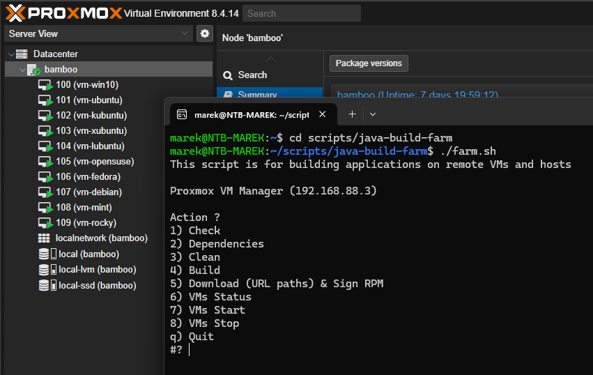

# Java Build Farm

<p align="center">
  
</p>

## Table of Contents

- [Overview](#overview)
- [Features](#features)
- [Prerequisites](#prerequisites)
- [Directory Structure](#directory-structure)
- [Usage](#usage)
- [Build Nodes and Inventory](#build-nodes-and-inventory)
- [Installation and Node Provisioning](#installation-and-node-provisioning)
- [SSH Key-Based Authentication](#ssh-key-based-authentication)
- [RPM Signing (GPG)](#rpm-signing-gpg)
- [License](#license)

## Overview

Java Build Farm is a script-based automation system for building and packaging Java applications across multiple operating systems and distributions. It enables automatic dependency installation, building, and distribution of Java applications using Proxmox virtual machines and remote hosts.

> The RadioRec application is used as an example. More information can be found in the repository on **[GitHub](https://github.com/MarelisAdlatus/radiorec)**.

## Platforms and Test Matrix

The supported platform tiers (baseline targets, UI/UX targets, rolling releases, etc.) are defined in:

- **[`PLATFORMS.md`](PLATFORMS.md)**

This document is the source of truth for:

- release blocker targets (Tier 1)
- extended desktop/UI coverage (Tier 2+)
- rolling release early warning targets
- naming conventions (normalize to `x86_64`)

## Features

- Automated dependency installation for Linux and Windows hosts
- Support for multiple operating systems and distributions:
  - Windows (10/11)
  - Debian, Ubuntu (LTS and non-LTS), Fedora, Rocky Linux, openSUSE (Leap/Tumbleweed), Linux Mint, Pop!_OS
- SSH-based remote execution and deployment
- Java Runtime creation using `jlink`
- Application packaging using `jpackage`
- Multi-platform package generation (`.deb`, `.rpm`, `.pkg`, `.exe`)
- Automated RPM package signing using GPG
- `.exe` installer builds using [Inno Setup Compiler](https://jrsoftware.org/isinfo.php)
- Remote VM/host provisioning via Proxmox (optional)
- Secure, passwordless SSH authentication

## Prerequisites

### On Java Build Farm (local machine)

- **Linux with GNU Bash**
- **Internet access**
- **SSH client:** `ssh`, `scp`
- **Other utilities:** `ping`, `sudo`, `bash`, `tar`, `find`, `awk`, `sed`, `cut`, `head`, `tr`, `rm`, `mkdir`, `chmod`, `sha256sum`
- **RPM Signing:** `rpmsign` (usually from the `rpm-sign` or `rpm` package) and `gpg` (for key management)
- **Proxmox:** (optional, only if using Proxmox for VM lifecycle actions in the menu)
- **PowerShell 7+:** (only needed if you build on Windows targets)

### On Build Stations (remote machines)

- **Internet access**
- **SSH Server** with key-based authentication enabled
- **Linux stations:** `sudo` configured for non-interactive execution (passwordless sudo is recommended for automation)
- **Windows stations:** PowerShell 7+ and OpenSSH Server (key-based login recommended)

> Detailed per-node installation procedures (including PowerShell installation and passwordless sudo configuration) are documented under `docs/installation/`.

## Directory Structure

```text
java-build-farm/
├── README.md                        # Project documentation
├── apps/                            # Source code and metadata for applications
│   └── AppName/
│       └── 1.0/                     # Application version folder
│           ├── AppName.iss          # Windows installer (Inno Setup script)
│           ├── AppName.properties   # File association definitions
│           ├── AppName.ps1          # Build script for Windows
│           ├── AppName.sh           # Build script for Linux
│           ├── addons/              # Additional resources such as licenses
│           │   └── License.txt
│           ├── build/               # Compiled application JARs
│           │   ├── AppName-1.0.jar
│           │   └── libs/            # Required libraries
│           │       ├── *.jar
│           └── icons/               # Application icons
│               ├── *.ico
│               └── *.png
├── config/                          # Build environment definitions
│   ├── global.cfg
│   ├── hosts.cfg
│   └── vms.cfg
├── depends.ps1                      # Dependency setup for Windows
├── depends.sh                       # Dependency setup for Linux/macOS
├── docs/
│   ├── installation/                # Node setup documentation (VMs and hosts)
│   └── images/
├── farm.sh                          # Central build and packaging script
└── release/                         # Output directory for generated packages
    └── appname/
        └── 1.0/
            └── *-*/                 # Platform-specific folders (OS + version + arch)
                ├── *.deb/.rpm       # Native packages (Linux)
                ├── *.exe            # Windows installers
                ├── *.zip            # Portable builds
                └── *.tar.gz         # Archive versions
```

## Usage

### Running `farm.sh`

Execute the main script to access the menu:

```sh
./farm.sh
```

Example output:

```text
This script is for building applications on remote VMs and hosts

Proxmox VM Manager (192.168.88.3)

Action ?
1) Check
2) Dependencies
3) Clean
4) Build
5) Download (URL paths)
6) Sign & Hash
7) VMs Status
8) VMs Start
9) VMs Stop
q) Quit
#?
```

Select an action by entering the corresponding number or <kbd>q</kbd> for exit.

### Menu Options (high level)

- **1) Check**
  Verifies SSH connectivity and basic prerequisites on all configured nodes.

- **2) Dependencies**
  Installs required OS packages/tools on remote nodes by running:

  - `depends.sh` on Linux targets
  - `depends.ps1` on Windows targets

- **3) Clean**
  Deletes remote build artifacts and local release outputs for a selected app/version.

- **4) Build**
  Copies app sources to targets and runs platform-specific build scripts (`.sh` / `.ps1`).

- **5) Download**
  Downloads produced artifacts via SSH/SCP into the local `release/` structure.
  Optionally normalizes directory names when `release_url_paths=yes`.

- **6) Sign & Hash**
  Signs RPMs and generates SHA256 checksum files for downloaded artifacts.

- **7–9) VM lifecycle (optional)**
  Available only when Proxmox is configured in `config/global.cfg`.
  Used for VM status/start/stop operations.

## Build Nodes and Inventory

The build farm can use:

- **Proxmox virtual machines** (defined in `config/vms.cfg`)
- **Remote hosts** (defined in `config/hosts.cfg`)

Configuration files:

- `config/global.cfg`
  Global settings (paths, optional Proxmox access, GPG key ID, etc.)

- `config/vms.cfg`
  Proxmox-managed VMs (VM ID + SSH endpoint). Used by VM lifecycle menu actions.

- `config/hosts.cfg`
  Non-Proxmox machines reachable via SSH (workstations, servers, etc.)

### Current node set (documentation reference)

The detailed installation steps for each node live in `docs/installation/`.

These are the currently documented nodes:

**Host nodes (`hosts.cfg`):**

- **Windows 11 Pro 25H2 x64 (host)**  
  [Documentation](docs/installation/host-windows-11-25h2-x64.md)

**VM nodes (`vms.cfg` / Proxmox-managed):**

- **VM 100 – Windows 10 Pro 22H2 x64**  
  [Documentation](docs/installation/vm-100-windows-10-22h2-x64.md)

- **VM 101 – Ubuntu 24.04.3 LTS x86_64**  
  [Documentation](docs/installation/vm-101-ubuntu-24.04.3-lts-x86_64.md)

- **VM 102 – Debian 13.3 (Trixie) stable x86_64**  
  [Documentation](docs/installation/vm-102-debian-13.3-trixie-stable-x86_64.md)

- **VM 103 – openSUSE Leap 16.0 x86_64**  
  [Documentation](docs/installation/vm-103-opensuse-leap-16.0-x86_64.md)

- **VM 104 – Rocky Linux 10.1 x86_64**  
  [Documentation](docs/installation/vm-104-rocky-linux-10.1-x86_64.md)

- **VM 105 – Kubuntu 24.04.3 LTS x86_64**  
  [Documentation](docs/installation/vm-105-kubuntu-24.04.3-lts-x86_64.md)

- **VM 106 – Linux Mint 22.3 (Cinnamon) x86_64**  
  [Documentation](docs/installation/vm-106-linux-mint-22.3-cinnamon-x86_64.md)

- **VM 107 – Xubuntu 24.04.3 LTS x86_64**  
  [Documentation](docs/installation/vm-107-xubuntu-24.04.3-lts-x86_64.md)

- **VM 108 – Fedora Workstation 43 x86_64**  
  [Documentation](docs/installation/vm-108-fedora-workstation-43-x86_64.md)

- **VM 109 – Ubuntu 25.10 (non-LTS) x86_64**  
  [Documentation](docs/installation/vm-109-ubuntu-25.10-x86_64.md)

- **VM 110 – openSUSE Tumbleweed x86_64**  
  [Documentation](docs/installation/vm-110-opensuse-tumbleweed-x86_64.md)

- **VM 111 – Pop!_OS 24.04 LTS x86_64**  
  [Documentation](docs/installation/vm-111-pop!_os-24.04-lts-x86_64.md)

## Installation and Node Provisioning

All installation and provisioning procedures were moved out of this README to:

- `docs/installation/*.md`

This includes:

- Proxmox VM reference configs (`qm config ...`)
- OS installation steps
- PowerShell installation and OpenSSH setup on Windows nodes
- passwordless sudo configuration on Linux nodes
- distro-specific firewall and SSH enablement details

Use the per-node documents above as the source of truth.

## SSH Key-Based Authentication

The build farm relies on SSH for remote execution and artifact transfer.

### Generate an SSH key (on the machine running `farm.sh`)

```sh
ssh-keygen -t ed25519 -C "build-farm-key" -f ~/.ssh/id_ed25519
```

Copy the public key to nodes:

- Manual method: append to `~/.ssh/authorized_keys` on Linux nodes
- Automated method (Linux): `ssh-copy-id -i ~/.ssh/id_ed25519.pub user@host`

> Windows nodes use OpenSSH Server and Windows ACL rules.
> Exact steps are documented per node under `docs/installation/`.

## RPM Signing (GPG)

For automatic RPM package signing during the **Download** step, the GPG environment must be properly configured on the local machine (the machine running `farm.sh`).

### 1. Generate a New GPG Key

Start the interactive key generation process:

```bash
gpg --full-generate-key
```

Use the following recommended options:

- **Key type:** `RSA and RSA`
- **Key size:** `4096`
- **Key expiration:** `0` (does not expire) or set according to your policy
- **Real name:** Your name or project name (e.g. `RPM Signing`)
- **Email address:** Project or maintainer email
- **Comment:** Optional (can be left empty)

Confirm the entered details and choose a **strong passphrase** when prompted.

> Note: The passphrase will be required during RPM signing unless an agent or unattended signing setup is used.

#### List and Identify the Key ID

After creation, list your secret keys:

```bash
gpg --list-secret-keys --keyid-format long
```

Example output:

```text
sec   rsa4096/9E736AF1D162F3F6 2026-02-08 [SC]
      9E736AF1D162F3F6FF21E3659A1A41C5DDF5A11A
uid   [ultimate] RPM Signing <signing@example.com>
```

Use the **full fingerprint** or the **long key ID** (recommended) in all configuration files.

#### Export the Private Key (Optional, for Backup or CI)

```bash
gpg --export-secret-keys --armor 9E736AF1D162F3F6 > private-key.asc
```

**Keep this file secret.**

#### Export the Public Key (for Repository Users)

```bash
gpg --export --armor 9E736AF1D162F3F6 > RPM-GPG-KEY-user
```

### 2. Importing the Private Key

Verify the private key exists:

```sh
gpg --list-secret-keys --keyid-format long
```

If missing, import it:

```sh
gpg --import /path/to/your/private-key.asc
```

### 3. Configuring `~/.rpmmacros`

Create or modify `~/.rpmmacros`:

```sh
nano ~/.rpmmacros
```

Add:

```cfg
%__gpg /usr/bin/gpg
%_gpg_name 9E736AF1D162F3F6FF21E3659A1A41C5DDF5A11A
```

### 4. Setting the Key ID in `global.cfg`

Verify `config/global.cfg`:

```cfg
gpg_key_id="9E736AF1D162F3F6FF21E3659A1A41C5DDF5A11A"
```

## License

This project is licensed under the [Apache License 2.0](LICENSE).

:arrow_up: [Back to top](#top)
